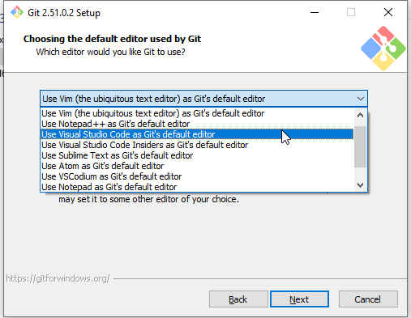
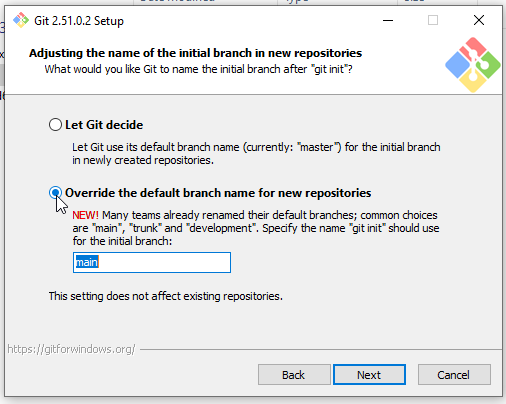
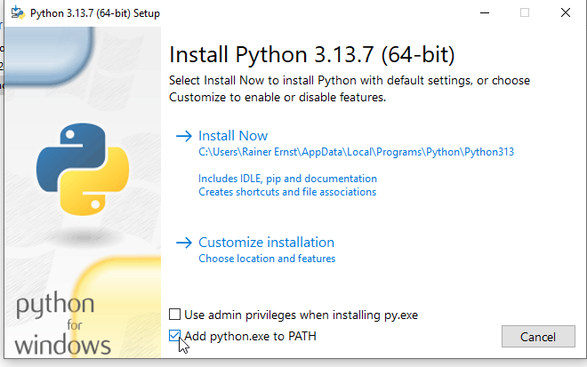
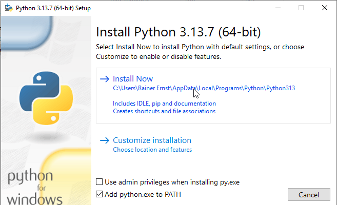

# Setting up our environment

## 0. How to open a Terminal (you will need this for the installation)

If you have never worked with the CMD/PowerShell/Bash terminal on your operating system, take some time to read about these command-line interfaces. It's always useful to know how to navigate through folders or use them for simple tasks, etc.  
For example:  
- **Windows**: [Cmd commands under Windows](https://www.thomas-krenn.com/en/wiki/Cmd_commands_under_Windows)  
- **Mac**: [Bash Shell Tutorial](https://mmuratarat.github.io/2020-04-01/bash_shell_tutorial)  

(Both resources are a bit extensive, so just pick what you need or ask an LLM for help.)

### On Windows
- **Method 1**: Press `Win + R`, type `cmd`, and press Enter.
- **Method 2**: Press `Win + X` and select "Command Prompt" or "Windows PowerShell."
- **Method 3**: Search for "Command Prompt" or "PowerShell" in the Start menu.

### On macOS
- **Method 1**: Press `Cmd + Space`, type "Terminal," and press Enter.
- **Method 2**: Go to Applications → Utilities → Terminal.

---

## 1. Download & Install VS Code
1. Download the installer from [the official website](https://code.visualstudio.com/).
2. Run the installer. The default settings should work fine.

---

## 2. Download & Install Git

### Check if Git is already installed
Open a terminal, type the following command, and press Enter:
```bash
git --version
```
If Git is installed, you'll see something like `git version 2.x.x`. If not, you'll get an error message saying the command is not found. If Git is already installed, you don't need to reinstall it.

### Installation on Linux
Git is usually pre-installed on Linux. If it's not, you probably know how to install it using your package manager.

### Installation on Windows
1. Download Git for Windows from [the official page](https://git-scm.com/downloads/win).
2. Run the installer. Most of the default settings should work, but check [Configuration during the installation](#configuration-during-the-installation) for some exceptions.
3. After installation, open a new terminal and verify the installation with:
   ```bash
   git --version
   ```
4. Great! Now proceed to [Configuration after the installation](#configuration-after-the-installation).

### Installation on macOS
- **Method 1**: Install using Homebrew. Open a terminal and type:
  ```bash
  brew install git
  ```
- **Method 2**: Download Git from [the official page](https://git-scm.com/downloads/mac) and run the installer. Most of the default settings should work, but check [Configuration during the installation](#configuration-during-the-installation) for some exceptions.

*After installation, proceed to [Configuration after the installation](#configuration-after-the-installation).*

---

### Configuration during the installation
1. While most of the default settings are fine, make sure to set VS Code as the default editor for Git:

   

2. Follow the current convention and name the default branch "main":

   

If you're installing Git via the terminal on macOS or Linux, you can change these defaults after installation by running the following commands:
```bash
git config --global core.editor "code"
```
and
```bash
git config --global init.defaultBranch "main"
```

---

### Verify Installation
After installing Git on any platform, open a new terminal and run:
```bash
git --version
```
You should see the Git version number if the installation was successful.

---

### Configuration after the installation
After installing Git, we need to make some basic configurations. These settings are necessary to let others know who made changes in a GitHub repository.

1. Set the default username. Use your GitHub username for now:
   ```bash
   git config --global user.name "Alice Bob"
   ```
2. Add a default email address. Use the email address associated with your GitHub account:
   ```bash
   git config --global user.email "alice@example.com"
   ```

To verify your settings, you can check them by typing:
```bash
git config --global user.name
```
and
```bash
git config --global user.email
```

---

## 3. Download & Install Python

### Check if Python is already installed
You should be running a version like Python 3.10.3. Any version starting with "3" is fine for us. (Version 2 is outdated and significantly different, so we will stick with Python 3.)

#### On Linux
Open a terminal and run:
```bash
python3 --version
```
If that returns an error, try:
```bash
python --version
```

#### On macOS
Open the Terminal and run:
```bash
python3 --version
```

#### On Windows
Open Command Prompt or PowerShell and run:
```powershell
python --version
```
Or use the Python launcher:
```powershell
py --version
```

---

### Did this result in an error? Then install Python.
On macOS and Linux, you're on your own. Keep in mind that running multiple Python versions on one system might cause issues. Ask me if you run into difficulties.

#### On Windows
1. Download Python from [the official website](https://www.python.org/downloads/windows/).
2. Run the installer.
3. Make sure to check the option to add Python to the PATH.

   

4. Click "Install Now" (the default settings should work fine).

   
